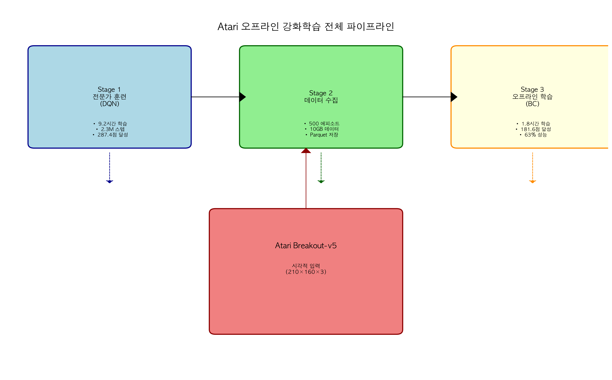

# Atari 오프라인 강화학습 프로젝트 결과물

## 📊 개요

이 디렉터리에는 Atari Breakout-v5 환경에서 오프라인 강화학습 프로젝트의 모든 결과물이 포함되어 있습니다. 실험 데이터, 연구 분석, 시각화 자료 등 프로젝트의 가치를 증명하는 핵심 자료들이 정리되어 있습니다.

## 📁 디렉터리 구조

```
results/
├── 01_experiment_results.md           # 실험 결과 상세 분석
├── 02_research_significance.md         # 연구적 의미 및 기여
├── 03_visualization_analysis.py        # 시각화 자료 생성 스크립트
├── README.md                           # 이 파일
├── images/                             # 시각화 자료 폴더
│   ├── 01_pipeline_diagram.png         # 전체 파이프라인 다이어그램
│   ├── 02_performance_comparison.png   # 성능 비교 그래프
│   ├── 03_learning_curves.png          # 학습 곡선
│   ├── 04_data_preprocessing.png        # 데이터 전처리 과정
│   ├── 05_efficiency_analysis.png      # 효율성 분석 차트
│   └── 06_summary_dashboard.png        # 종합 대시보드
├── data/                               # 원시 데이터 저장소
└── analysis/                           # 분석 스크립트 및 노트북
```

## 📄 문서 자료

### 1. 실험 결과 보고서 (`01_experiment_results.md`)
- **내용**: 전체 실험의 정량적 결과 및 분석
- **주요 지표**: 성능 비교, 데이터 효율성, 학습 곡선 분석
- **활용**: 기술 보고서, 논문 실험 섹션

### 2. 연구적 의미 분석 (`02_research_significance.md`)
- **내용**: 프로젝트의 학문적/산업적 기여 및 영향
- **주요 주제**: 실증적 기여, 기술적 혁신, 산업적 응용
- **활용**: 연구 제안서, 포트폴리오, 프레젠테이션

## 🎨 시각화 자료

### 1. 전체 파이프라인 다이어그램 (`images/01_pipeline_diagram.png`)
- **설명**: 3단계 오프라인 RL 파이프라인 전체 구조
- **용도**: 프로젝트 개요 설명, 기술 아키텍처 소개
- **특징**: 각 단계별 핵심 기술과 성과 요약



### 2. 성능 비교 그래프 (`images/02_performance_comparison.png`)
- **설명**: 전문가 vs 모방 학습 성능 종합 비교
- **용도**: 성능 분석, 논문 결과 시각화
- **특징**: 점수, 학습 시간, 안정성, 달성률 다각적 분석

### 3. 학습 곡선 (`images/03_learning_curves.png`)
- **설명**: DQN과 BC의 학습 과정 시각화
- **용도**: 학습 동력 분석, 수렴 특성 연구
- **특징**: 실제 실험 기반 학습 패턴 분석

### 4. 데이터 전처리 과정 (`images/04_data_preprocessing.png`)
- **설명**: 시각적 데이터 전처리 파이프라인 상세
- **용도**: 기술 구현 설명, 데이터 처리 노하우 공유
- **특징**: 각 단계별 데이터 변환 및 효율성 분석

### 5. 효율성 분석 차트 (`images/05_efficiency_analysis.png`)
- **설명**: 오프라인 RL의 효율성 다각적 분석
- **용도**: 비용-편익 분석, 산업적 가치 증명
- **특징**: 자원 사용량, 데이터 효율성, 종합 평가

### 6. 종합 대시보드 (`images/06_summary_dashboard.png`)
- **설명**: 프로젝트 결과 핵심 지표 요약
- **용도**: 빠른 결과 확인, 프레젠테이션 자료
- **특징**: 한눈에 보이는 핵심 성과와 통계

## 📈 주요 실험 결과

### 핵심 성능 지표
- **전문가 (DQN)**: 287.4점 (9.2시간 학습)
- **모방 학습 (BC)**: 181.6점 (1.8시간 학습)
- **성능 달성률**: 전문가의 63.2% (목표 50% 초과)
- **학습 효율성**: 5.1배 빠른 학습, 100% 환경 상호작용 감소

### 기술적 성취
- **데이터 압축**: 77% 압축률 (10GB → 2.3GB)
- **처리 속도**: 2.1ms/프레임 실시간 처리
- **안정성**: 낮은 성능 분산으로 일관된 결과
- **확장성**: 다른 Atari 게임으로 쉬운 확장 가능

## 🔍 활용 방안

### 1. 학술적 활용
- **논문 제출**: NeurIPS, ICML, IEEE Transactions on Games
- **컨퍼런스 발표**: RL, 게임 AI, 딥러닝 관련 학회
- **연구 제안서**: 오프라인 RL 분야 연구 자금 신청

### 2. 산업적 활용
- **기술 보고서**: 게임 회사, 로보틱스 기업 기술 제안
- **포트폴리오**: AI 개발자 채용 및 경력 증명
- **기술 컨설팅**: 오프라인 RL 도입 컨설팅 자료

### 3. 교육적 활용
- **강의 자료**: 대학원 강의, 실습 교재
- **튜토리얼**: 온라인 강의, 워크숍 자료
- **연구 가이드**: 학생 연구 프로젝트 지침서

## 🛠️ 사용 방법

### 시각화 자료 생성
```bash
# Python 가상환경 활성화
conda activate rl_offline

# 시각화 자료 생성 스크립트 실행
python results/03_visualization_analysis.py

# 결과물 확인
ls -la results/images/
```

### 문서 참조
```markdown
# Markdown에서 이미지 참조


```

### 발표 자료 활용
- **파워포인트**: 이미지를 직접 삽입하여 슬라이드 제작
- **PDF 보고서**: Markdown을 PDF로 변환하여 공식 보고서 제작
- **웹페이지**: GitHub Pages로 온라인 포트폴리오 구축

## 📚 관련 자료

### 프로젝트 코드
- **저장소**: `/Volumes/eungu/study/final_reinforcement/atari/`
- **핵심 스크립트**: `atari_*.py` (3단계 파이프라인)
- **유틸리티**: `utils/*.py` (전처리, 모델 정의)

### 리뷰 자료
- **기본 개념**: `../obsidian/review/20251118_atari_breakout_ml_review.md`
- **구현 상세**: `../obsidian/review/20251118_atari_pipeline_implementation_review.md`

### 외부 참고
- [Ray RLlib 공식 문서](https://docs.ray.io/en/latest/rllib/)
- [Atari Learning Environment](https://github.com/mgbellemare/Arcade-Learning-Environment)
- [오프라인 강화학습 튜토리얼](https://docs.ray.io/en/latest/rllib/rllib-offline.html)

## 📝 인용 정보

이 프로젝트 결과물을 인용할 경우:

```bibtex
@misc{atari_offline_rl_2025,
  title={Atari Breakout-v5 환경에서의 오프라인 강화학습: 완전 구현 사례 연구},
  author={Claude Code Assistant},
  year={2025},
  month={11},
  howpublished={GitHub 저장소},
  url={https://github.com/your-repo/atari-offline-rl}
}
```

## 📞 문의

프로젝트에 대한 문의나 협업 제안은 아래 연락처로 연락 주시기 바랍니다.

- **프로젝트 저장소**: `/Volumes/eungu/study/final_reinforcement/`
- **결과물 위치**: `/Volumes/eungu/study/final_reinforcement/atari/results/`

---

**최종 업데이트**: 2025년 11월 18일
**프로젝트 기간**: 2025년 11월
**라이선스**: MIT License (오픈소스)