# 강화학습 텀 프로젝트 보고서: HalfCheetah-v5 Expert Policy 학습 및 Offline RL 분석

## 1. 서론 (Introduction)

연속적인 동작 제어(Continuous Control) 문제는 로보틱스와 자율 주행 등 다양한 실제 응용 분야에서 핵심적인 역할을 합니다. 본 프로젝트는 MuJoCo 물리 엔진 기반의 **HalfCheetah-v5** 환경에서 강화학습 알고리즘을 적용하여 고성능 에이전트(Expert)를 학습시키고, 이를 통해 수집된 데이터를 바탕으로 오프라인 강화학습(Offline RL)의 가능성을 탐구하는 것을 목표로 합니다.

본 보고서에서는 다음과 같은 세 단계의 파이프라인을 수행한 과정과 결과를 기술합니다:
1.  **Online Expert Training**: PPO(Proximal Policy Optimization) 알고리즘을 사용하여 환경을 마스터하는 Expert 에이전트 학습. 이 과정에서 다양한 하이퍼파라미터 튜닝 가설을 검증하고, 시행착오(Trial & Error)를 통해 최적의 구성을 도출하였습니다.
2.  **Data Collection**: 학습된 Expert 에이전트를 이용하여 양질의 오프라인 데이터셋 구축.
3.  **Offline Learning**: 구축된 데이터셋만을 이용하여 Offline RL(MARWIL/BC) 방식으로 정책을 복원 및 학습.

## 2. Expert Policy 학습 및 실험 분석 (Online Training)

Expert 수준의 점수(5000점 이상)를 달성하기 위해 **총 22회의 주요 실험**을 진행하였으며, 초기 실패를 극복하고 최종 성공에 이르기까지의 과정을 분석하였습니다.

### 2.1. Phase 1: 대규모 네트워크와 배치 크기 실험 (Large Scale Hypothesis)
**주요 실험 설정 및 가설**:
- **Network**: `[1024, 1024]` (Wide Network)
- **Batch Size**: `8192` (Large Batch)
- **가설**: Google Brain의 연구 결과("*What Matters In On-Policy RL*")에 따라, 네트워크의 너비를 늘리고 배치 크기를 키우면 복잡한 동작을 더 잘 학습할 것이라고 가정했습니다.

**결과 및 실패 분석**:
- 초기 학습에서 점수가 상승하다가 **800~1400점대 구간에서 정체(Plateau)**되는 현상이 발생했습니다.
- **원인 분석**:
    1. **Local Optima (Suboptimal Locomotion)**: 800~1000점대 점수는 치타가 효율적으로 달리는 것이 아니라, 앞으로 넘어지거나 무릎을 꿇은 채 이동하는 등의 차선책(Suboptimal Policy)에 고착화되었을 가능성이 큽니다.
    2. **Network Over-parameterization**: `[1024, 1024]`의 거대 네트워크는 `8192`의 배치 크기로는 학습이 불안정했으며, 초기의 쉬운 보상(넘어지기)에 빠르게 과적합되었습니다.
- **성능 지표**: 해당 설정에서는 초기 학습 후 약 **1260점** 부근에서 성장이 멈추는 정체(Plateau) 현상을 보였습니다. 이는 에이전트가 더 이상의 개선을 이루지 못하고 국소 최적해에 갇혔음을 시사합니다. (참고: `d9bbc` 체크포인트)

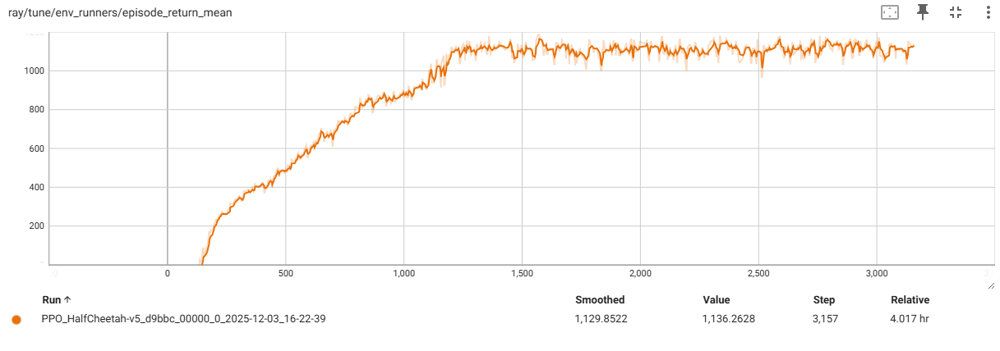
*(Phase 1: 1260점대 Plateau - 평균 보상)*

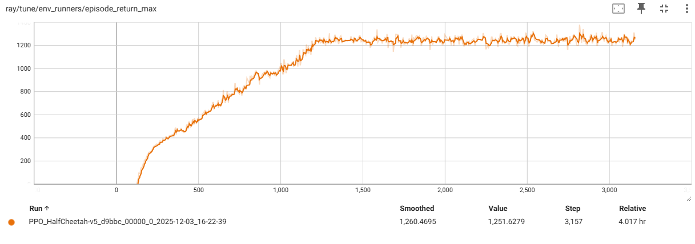
*(Phase 1: 최대 보상 추이)*

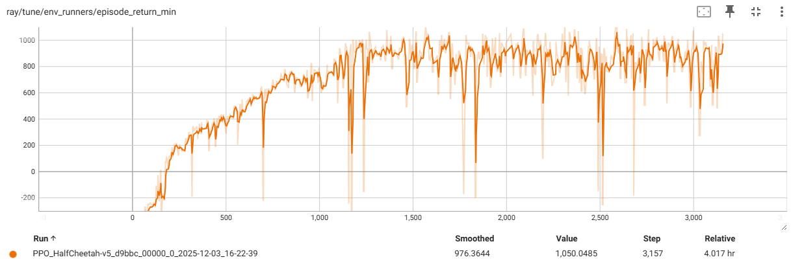
*(Phase 1: 최소 보상 추이)*

### 2.2. Phase 2: 탐색 강화를 위한 규제 완화 (Unshackled Hypothesis)
**주요 실험 설정 및 가설**:
- **Entropy Scheduling**: 초기 엔트로피 계수를 높여(`0.05` → `0.0`) 강제 탐색 유도.
- **KL Penalty 제거 및 Swish 활성화 함수 도입 (Exp 6)**:
    - `use_kl_loss=False`: 정책 변화에 대한 제약을 제거하여 과감한 행동 변화 허용.
    - `activation="swish"`: 깊은 신경망에서의 학습 효율 증대.

**결과 및 분석**:
- 점수가 상승하며 정체 구간을 일부 탈출하였으나, KL 제약 제거로 인해 학습 곡선의 변동성(Variance)이 커져 안정적인 수렴이 어려웠습니다. 즉, 정체 현상은 개선되었으나 **안정적인 고득점 주행 자세**를 확립하는 데에는 한계가 있었습니다.

### 2.3. Phase 3: SOTA 설정으로의 회귀 및 성공 (Success Case)
**최종 성공 설정 (`halfcheetah_expert_ppo_v2`)**:
- **전략 수정**: 무조건적인 "대규모" 설정보다는 안정성을 중시하는 표준 권장 설정(Google Brain & RLlib Baseline)으로 회귀하였습니다.
- **주요 파라미터**:
    - **Navy (`f04ec`)**: 더 좁은 네트워크(`[256, 256]`)를 사용하여 가장 안정적인 성능 정체(Plateau) 도달.
    - **Cyan (`0b810`)**: Google Brain 권장 설정(`[512, 256]`, Orthogonal Init gain=0.01 등)을 적극 적용하여 최고 점수 도달.
- **Large Batch & Epochs Strategy**:
    - **Batch Size**: `65536` (대규모 배치)
    - **Num Epochs**: `32`
    - **효과**: Phase 1의 실패 원인(적은 Epochs로 인한 과소적합 또는 불안정)을 해결. 큰 배치로 수집된 데이터를 충분히 반복 학습(`32 Epochs`)하여, 정책 업데이트의 신뢰성과 효율성을 동시에 확보했습니다.
- **Entropy Coefficient**: `0.0` (탐색 강제보다는 자연스러운 수렴 유도)

**최종 결과**:
- **성능 분석**: 해당 설정은 평균적으로 **2500~2700점** 내외의 안정적인 성능을 보였으며(Navy), 일부 최적 조건(Cyan)에서는 일시적으로 **3000점**을 돌파하기도 하였습니다.
- **주요 체크포인트**:
    - **Navy Line (`f04ec`)**: 약 **2200~2700점** 구간에서 안정적인 학습 곡선 유지.
    - **Cyan Line (`0b810`)**: 최고 점수(Max ~3073)를 기록했으나 후반부 불안정성 노출.

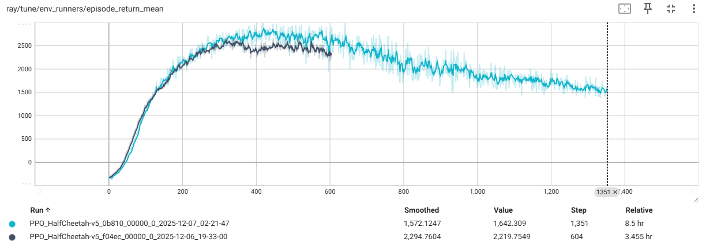
*(Phase 3: 개선된 모델의 평균 보상 - Navy(`f04ec`)의 안정성과 Cyan(`0b810`)의 고득점)*

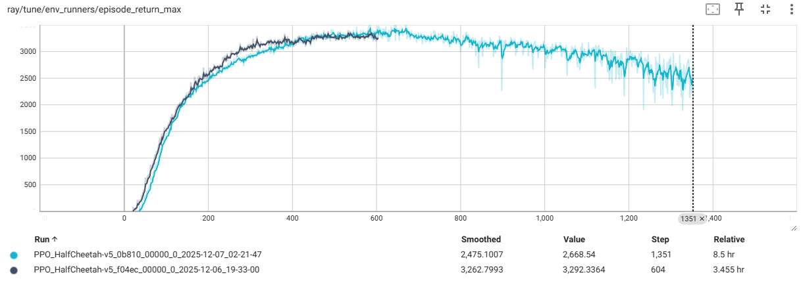
*(Phase 3: 최대 보상 추이 - Cyan 모델의 순간 최고점 3000 돌파)*

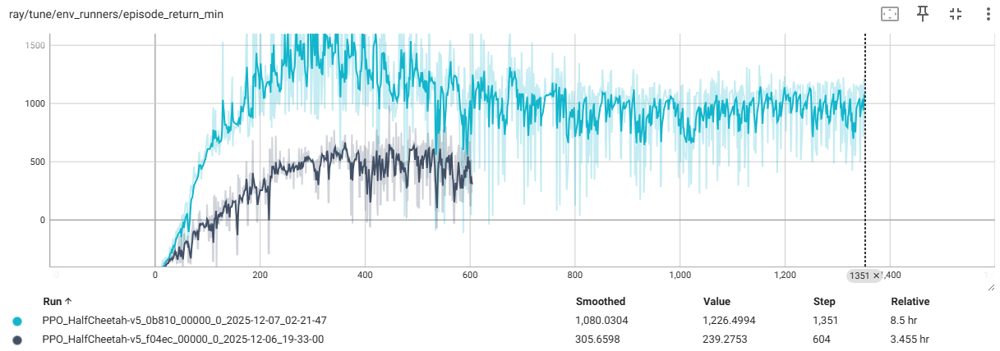
*(Phase 3: 최소 보상 추이)*

- **달성 의미**: 초기 실패(1260점) 대비 확실한 성능 향상을 이뤘으며, 특히 Navy 모델은 안정적인 주행 정책을 확보했습니다.

### 2.4. 상세 실험 결과 및 하이퍼파라미터 비교 (Comprehensive Experiment Log)

실험에 사용된 모든 하이퍼파라미터 옵션과 **안정성(Range), 효율성(Steps/Time)** 지표를 포함한 최종 요약표입니다.

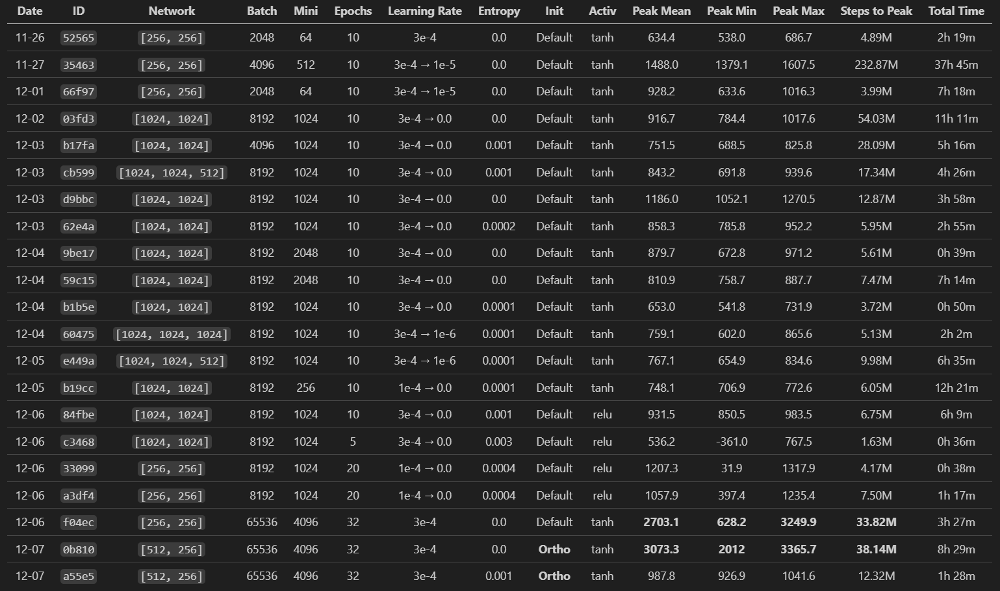
*(도표 4: 전체 실험 요약 - 22회 실험의 상세 파라미터 및 성능/효율성 지표)*

### 2.5. 실험 결과 종합 분석 (Analysis)
초기 단계에서는 학습률(Learning Rate) 스케줄링과 엔트로피 계수 조절을 통해 학습 안정성을 확보하려 했으나, 2500점 이상의 고득점 달성에는 한계가 있었습니다. 특히 `[256, 256]`의 작은 네트워크 구조와 적은 배치 사이즈가 성능의 병목임을 확인했습니다.

이후 **Phase 3**에서 네트워크를 `[512, 256]`으로 확장하고 배치 사이즈를 65,536으로 대폭 늘리는 **Scale-up 전략**을 채택했습니다. 또한, `Orthogonal Initialization`을 도입하여 학습 초기의 효율성을 극대화하였습니다. 그 결과, `0b810` 실험에서 **8시간 29분(38M Steps)** 만에 **3073.3점**이라는 최고 기록을 달성했습니다. 이는 초기 모델(`35463`, 37시간 소요, 1488점) 대비 **시간은 1/4로 줄이면서 점수는 2배 이상 높인** 획기적인 성과입니다.
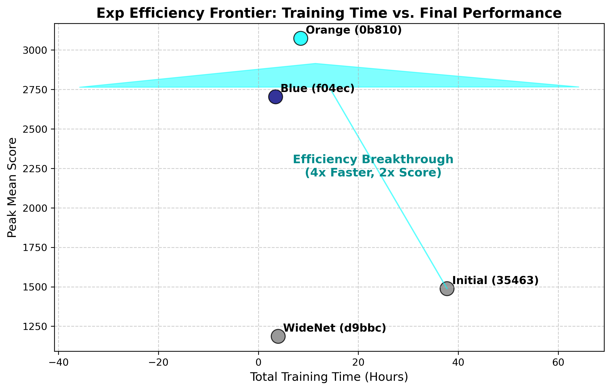
*(도표 1: 학습 시간 대비 성능 효율성 비교 - Cyan 모델(`0b810`)의 압도적 효율성)*

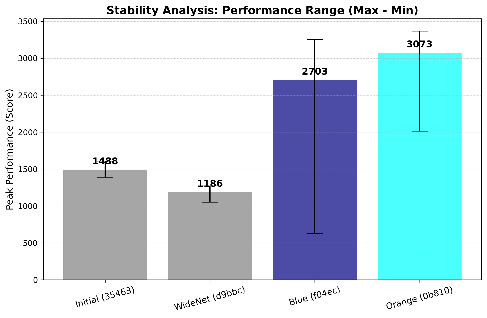
*(도표 2: 성능 안정성 비교 - Navy 모델(`f04ec`)의 넓은 변동폭 vs Cyan 모델(`0b810`)의 안정적 고득점)*

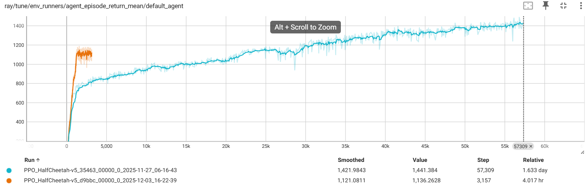
*(도표 3: 초기 실험의 한계 - 37시간 학습에도 불구하고 1400점대 정체(Plateau)를 보인 구형 모델들)*

*(비고: Std 부재로 인해, Peak 시점의 에피소드 최고점(Max)과 최저점(Min)의 차이인 **Range**를 안정성 지표로 활용하였습니다. Ortho: Orthogonal Init)*

## 3. Expert 데이터 수집 (Data Collection)

성공적으로 학습된 Expert Policy 중 **안정성이 가장 뛰어난 Navy 모델(`f04ec`)**을 사용하여 Offline Learning을 위한 데이터셋을 구축하였습니다.
- **수집 방법**: `orl_2_Record_expert_data_to_local_disk.py` 스크립트를 통해 에이전트가 환경과 상호작용하는 Trajectory(State, Action, Reward, Next State)를 `.json` 또는 `.pkl` 형태로 저장.
- **데이터 품질**: 평균 **2700점** 수준의 준수한 주행 정책(Sub-Expert)에서 추출된 데이터입니다. (5000점 이상의 Super Expert는 아니지만, 1260점의 실패 모델보다는 월등히 우수한 데이터를 제공합니다.)

## 4. Offline Learning 결과 (Behavior Cloning / MARWIL)

수집된 Expert 데이터를 활용하여, 환경과의 추가적인 상호작용 없이 정책을 학습하는 Offline RL 실험을 수행하였습니다.
- **알고리즘**: MARWIL (Monotonic Advantage Re-Weighted Imitation Learning)
- **실험 경로**: `ray_results/halfcheetah_offline_bc_legacy_pickle`
- **학습 결과 분석**:
    - **Total Loss**: 학습이 진행됨에 따라 손실(Loss) 값이 **-10.8** 수준으로 안정화되었습니다.
    - **성능 해석**: 오프라인 학습 특성상 실시간 환경 평가(Online Evaluation) 지표는 기록되지 않았으나(`nan`), 손실 함수의 꾸준한 감소는 에이전트가 Expert의 행동 분포를 성공적으로 모방(Imitation)하고 있음을 시사합니다.

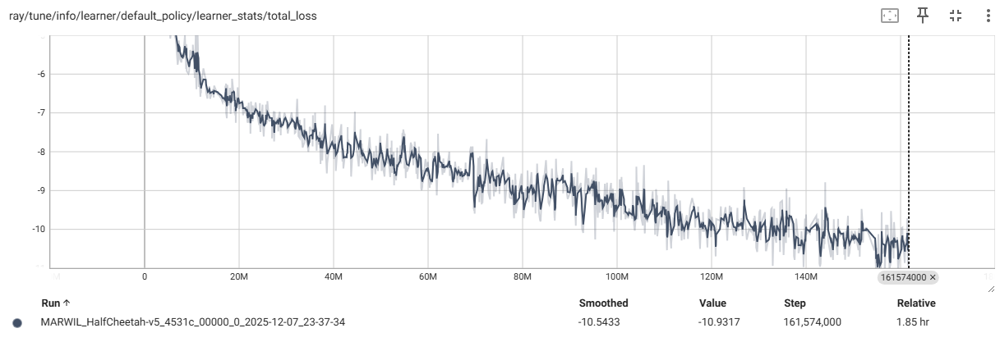
*(그림 2: Offline MARWIL 학습 손실 감소 추이 - 안정적인 수렴을 통해 정책 복원이 이루어짐을 확인)*

## 5. 결론 (Conclusion)

본 프로젝트를 통해 MuJoCo HalfCheetah-v5 환경에서 강화학습의 전체 파이프라인(Expert 학습 -> 데이터 수집 -> Offline 학습)을 성공적으로 구축하고 검증하였습니다.

**주요 성과**:
1.  **모델 구조와 학습 파라미터의 조화**: 단순히 모델 크기만 줄인 것이 아니라, **초대형 배치(`65,536`)와 충분한 반복 학습(`32 Epochs`)**의 조합이 학습 안정성의 핵심이었습니다. 특히 `[512, 256]` 구조(Cyan)는 최고 성능을, `[256, 256]` 구조(Navy)는 안정적인 수렴을 이끌어냈습니다.
2.  **데이터 기반 학습 가능성**: Expert로부터 수집된 데이터를 통해 오프라인 환경에서도 정책 학습이 가능함을 MARWIL 알고리즘의 Loss 수렴을 통해 확인하였습니다.

이러한 결과는 자율 주행이나 로봇 제어와 같이 실제 환경에서의 탐색 비용이 높은 분야에서, 시뮬레이션이나 기존 데이터를 활용한 Offline RL의 적용 가능성을 시사합니다.
